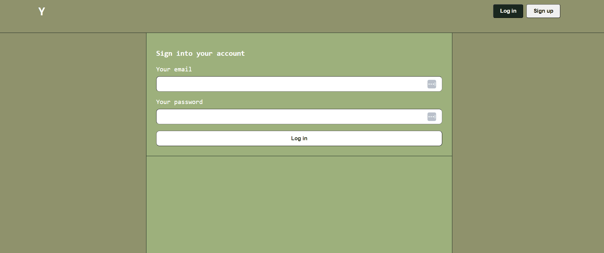

# Project-2

# Y [heroku]()

## Description

This program is a social media app designed to post your weather with your text. It was built to access weather data inside the app, as well as bring back the chronological timeline. We learned how to use handlebars to dynamically form the many pages of the website, the best practice of using dotenv and hiding information inside an env file, and accessing many node modules to utilize thoroughout the app! 

## Table of Contents 

- [Installation](#installation)
- [Usage](#usage)
- [Credits](#credits)
- [License](#license)

## Installation
- Make your own .env file 
Here is a template: 
DB_NAME='Y_db'
DB_USER='root'
DB_PASSWORD=''
WEATHER_API_KEY=''
NEWS_API_KEY=''
Gather your own keys and password!
- Make sure you have Node downloaded on your machine
[node](https://nodejs.org/en/download)
- Open up your terminal, and run npm install
- Then, run mysql -u root -p, enter password
- SOURCE db/schema.sql
- exit 
- node server.js 
- Open your browser, and type in localhost:3001
- Enjoy!!!

## Credits
[uno css](https://unocss.dev/)
[Open Weather API](https://openweathermap.org/current)
[News API](https://newsapi.org/)
npm modules: axios, bcrypt, express, express handlebars, express session, nodemon, handlebars, sequelize, connect session sequelize, mysql2, dotenv
Our TA's, Kimberly and Nicholas, our instructor Trey, and tutors!

## License
